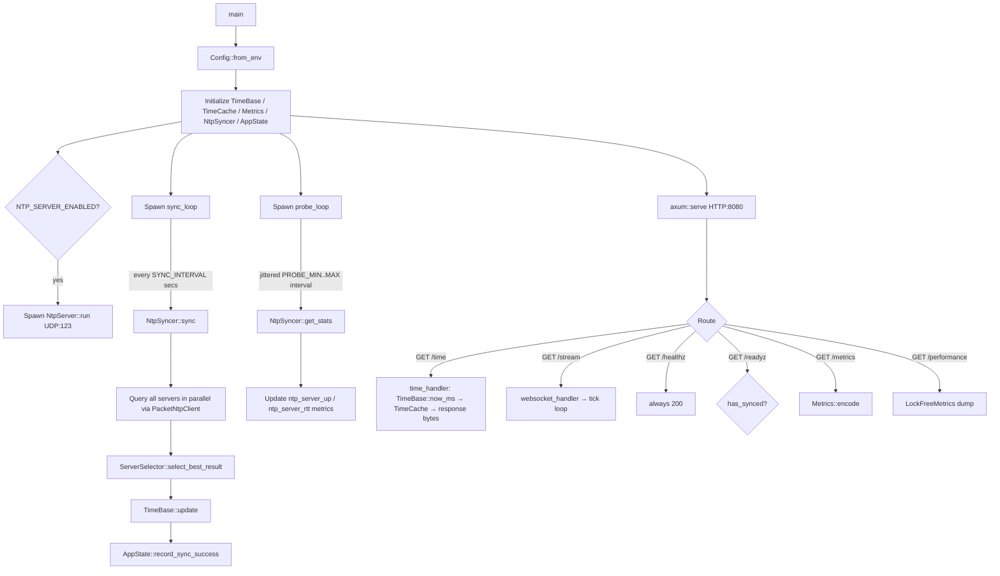

# PROJECT_ARCHITECTURE.md

Single source of truth for understanding the NTP Time JSON API project **as it exists today**
(current state, not future state).

> **For financial / time-critical deployments, see `PRODUCTION_ACCURACY_PLAN.md`.** Current
> limitations (P0-1/P0-2/P0-3/P0-4/P0-5 complete — T2/T3 and root fields measured from packet
> bytes; UDP NTP server advertises honest `root_delay`/`root_dispersion` per RFC 5905 §11.2;
> time-quality envelope, `/status`, `/time/full`, serve/stop policy, and quality headers live;
> real E2E test harness and CI `e2e` job in place):
> there is **no secure manual-override** path (P1-7).
> This is tracked as the P1 roadmap in `PRODUCTION_ACCURACY_PLAN.md`.

---

## High-Level Summary

A **production-oriented, general-purpose Rust HTTP service** that returns NTP-derived epoch time as
JSON. It avoids the OS wall clock entirely: time is sourced from upstream NTP servers via UDP,
stored in a lock-free monotonic `TimeBase`, and served from a pre-serialized JSON cache. The service
also optionally acts as a **Stratum-2 UDP NTP server** for downstream clients. Designed for
Kubernetes with proper health probes and Prometheus metrics.

**Readiness qualification.** This is suitable today as a general-purpose time API. It is **not yet
financial/time-critical production ready** — that requires completing P1-7 (manual override) and
reviewing the P1 roadmap in `PRODUCTION_ACCURACY_PLAN.md`. P0-1 through P0-5 are complete: T1–T4
are all measured, `rsntp` is removed, UDP NTP responses carry honest dispersion, the time-quality
envelope (`/status`, `/time/full`, serve/stop policy, quality headers) is live, and a real E2E
test harness runs in CI.
The architecture described below is the **current state**.

---

## Technology Stack

| Layer | Library / Version |
|---|---|
| HTTP server | `axum 0.8` + `hyper 1.8` |
| Async runtime | `tokio 1.48` (multi-thread) |
| NTP client | `PacketNtpClient` (in-house async UDP; `src/ntp/client.rs`; reads measured T2/T3 + root fields from packet bytes; `rsntp` removed in P0-1/P0-2) |
| Metrics | `prometheus-client 0.24.1` |
| Lock-free state | `arc-swap 1.9`, `parking_lot 0.12`, `std::sync::atomic` |
| Rate limiting | `tower_governor 0.8` |
| Serialization | `serde 1.0` + `serde_json 1.0` |
| Error handling | `thiserror 2.0` + `anyhow 1.0` |
| Time formatting | `chrono 0.4` |
| Allocator | `tikv-jemallocator 0.7` (jemalloc, global) |
| Container | `gcr.io/distroless/cc-debian13:nonroot` (UID 65532) |
| Rust edition | 2024 |

---

## Directory Structure

```
.
├── src/
│   ├── main.rs          Entry point, background task spawning, TCP socket setup
│   ├── config.rs        All env-var configuration (Config::from_env + validation)
│   ├── errors.rs        AppError enum → HTTP response mapping
│   ├── timebase.rs      Lock-free monotonic time model (core of the service)
│   ├── metrics.rs       Prometheus registry + all metric definitions
│   ├── performance.rs   TimeCache (zero-copy JSON) + LockFreeMetrics
│   ├── http/
│   │   ├── mod.rs       Router: fast path / slow path split, rate limiting, CORS
│   │   ├── handlers.rs  HTTP endpoint implementations
│   │   ├── middleware.rs Prometheus metrics tracking middleware
│   │   ├── state.rs     AppState (shared across all handlers)
│   │   └── websocket.rs WebSocket streaming endpoint (/stream)
│   └── ntp/
│       ├── mod.rs       Public re-exports
│       ├── protocol.rs  RFC 5905 NTP packet encode/decode (pure, no I/O)
│       ├── selection.rs Outlier-filtered, accuracy-first server selection
│       ├── stats.rs     Per-server health tracking (failures, RTT, auto-disable)
│       ├── sync.rs      NtpSyncer: parallel queries + sticky server selection
│       └── server.rs    UDP NTP server (Stratum 2, responds to NTP clients)
├── tests/
│   ├── common/mod.rs        E2E test helpers (mock NTP, spawn server, UDP helpers)
│   ├── e2e_http.rs          HTTP endpoint E2E tests (14 tests)
│   ├── e2e_ntp_udp.rs       UDP NTP server E2E tests (3 tests)
│   ├── e2e_websocket.rs     WebSocket streaming E2E tests (2 tests)
│   ├── e2e_metrics.rs       Prometheus metrics scrape E2E tests (3 tests)
│   └── integration_api.rs   Redirect comment → e2e_*.rs (placeholder removed)
├── k8s/
│   ├── deployment.yaml  3 replicas, probes, resources, NET_BIND_SERVICE
│   ├── service.yaml     ClusterIP, TCP:80→8080, UDP:123
│   ├── configmap.yaml   NTP server list
│   └── servicemonitor.yaml  Prometheus Operator scrape config
├── .github/workflows/ci.yml  CI: fmt + clippy + test + build + audit + docker
├── Dockerfile           Multi-stage: rust:1.92-bookworm → distroless
├── docker-compose.yml   Single-service compose with 24 NTP servers + Persian messages
├── Makefile             Common dev targets
├── examples/            Rust + Python client examples
└── observability/       (observability tooling, not inspected in depth)
```

---

## Main Runtime Flow



---

## Core Time Model (`src/timebase.rs`)

This is the most critical module. All reads are **lock-free** using atomics.

```
On successful NTP sync:
  base_epoch_ms   = NTP-derived epoch in milliseconds         [AtomicI64]
  base_instant_ns = Instant::now() - REFERENCE_INSTANT        [AtomicU64]
  has_synced      = true                                       [AtomicBool]

On each /time request (hot path, zero locks):
  elapsed_ns = Instant::now() - REFERENCE_INSTANT - base_instant_ns
  now_ms     = base_epoch_ms + elapsed_ns / 1_000_000
  if MONOTONIC_OUTPUT:
    now_ms = max(now_ms, last_served_ms)   [CAS loop on AtomicI64]
```

`REFERENCE_INSTANT` is a `once_cell::Lazy<Instant>` initialized at program start — never changes.

---

## `AppState` (`src/http/state.rs`)

Shared across all Axum handlers via `Arc<AppState>`. Cloned cheaply per request.

| Field | Type | Purpose |
|---|---|---|
| `config` | `Arc<Config>` | Immutable runtime config |
| `timebase` | `TimeBase` | Lock-free time source (Clone = Arc clone) |
| `metrics` | `Arc<Metrics>` | Prometheus counters/histograms |
| `time_cache` | `Arc<TimeCache>` | Pre-serialized JSON (zero-copy) |
| `perf_metrics` | `Arc<LockFreeMetrics>` | `/performance` endpoint data |
| `last_sync_time` | `Arc<RwLock<Option<Instant>>>` | Staleness tracking |
| `consecutive_failures` | `Arc<RwLock<u32>>` | NTP failure counter |
| `last_rtt_ms` | `Arc<AtomicU64>` | RTT of last successful NTP sync (ms); propagated to UDP NTP server as `root_delay` |
| `last_ntp_timing` | `Arc<RwLock<Option<NtpTimingSummary>>>` | RFC 5905 T1–T4 four-tuple from last sync; exposed in `/performance` as `"ntp_timing"` |

---

## HTTP API Surface

| Method | Path | Auth | Description |
|---|---|---|---|
| GET | `/` | none | Alias for `/time` |
| GET | `/time` | none | Returns NTP epoch_ms as JSON (fast path, no middleware); quality headers on 200 |
| GET | `/time/full` | none | Enriched JSON with quality fields (slow router); same serve/stop policy as `/time` |
| GET | `/status` | none | Always-200 quality envelope; read `serve_state` to know if `/time` would return 503 |
| GET | `/stream` | none | WebSocket: streams tick messages at `WS_UPDATE_INTERVAL_MS` |
| GET | `/healthz` | none | Liveness: always 200 |
| GET | `/readyz` | none | Readiness: 503 before first sync; after first sync, 503 when `uncertainty_ms > READINESS_MAX_UNCERTAINTY_MS` (default 250 ms) |
| GET | `/startupz` | none | Startup: 503 until first sync (if `REQUIRE_SYNC=true`) |
| GET | `/metrics` | none | Prometheus text exposition |
| GET | `/performance` | none | JSON: latency min/avg/max, cache hit rate, error rate, and `ntp_timing` (RFC 5905 T1-T4; null before first sync) |

### Fast path vs Slow path

`/time` and `/` bypass all middleware (no tracing, timeout, body limit, metrics). All others go through the full Tower middleware stack.

### Response Shape

**Success (`/time`):**
```json
{"data": 1735459200000, "message": "done", "status": 200}
```

**Pre-sync error:**
```json
{"data": 0, "error": "Service not yet synchronized with NTP", "message": "error", "status": 503}
```

**WebSocket tick:**
```json
{"type": "tick", "epoch_ms": 1735459200000, "iso8601": "2025-01-01T00:00:00+00:00", "is_stale": false, "staleness_secs": 5, "message": "done", "sequence": 42}
```

### Rate Limiting

**HTTP**: 1000 req/sec per IP, burst 100 (`tower_governor`). Set `DISABLE_RATE_LIMITING=true` to skip (useful for local dev where `PeerIpKeyExtractor` cannot find the peer IP). Disabled for test router.

**UDP NTP server**: Fixed-window per-IP rate limiter (`UdpRateLimiter`), default 100 req/sec. Exceeded requests are silently dropped. `limit = 0` disables.

---

## NTP Client Architecture (`src/ntp/`)

### Sync Flow

1. **`NtpSyncer::sync()`** queries ALL configured servers in parallel (Tokio tasks).
2. Each query uses `PacketNtpClient::query` (async UDP; `src/ntp/client.rs`) wrapped with `tokio::time::timeout`. T2/T3/root_delay/root_dispersion/precision are read directly from the NTP packet bytes — not reconstructed.
3. Results collected → **`ServerSelector::select_best_result()`** runs outlier filtering.
4. **Smart sticky**: switches server only if the new best is 50ms+ faster; otherwise keeps current server for stability.

### Server Selection Algorithm (`src/ntp/selection.rs`)

1. Compute **median offset** across all successful servers.
2. Reject servers where `|offset - median| > MAX_OFFSET_SKEW_MS` (default 1000ms).
3. Among inliers, pick server **closest to median offset** (accuracy-first).
4. RTT is only a tiebreaker when accuracy is equal.
5. Fallback: if all servers are outliers (network issues), use min-RTT server.

### RFC 5905 Four-Tuple

Each `NtpResult` carries `T1..T4` (client send, server recv, server send, client recv). All four are **measured** — T2 and T3 are read directly from the `receive_timestamp` and `transmit_timestamp` fields in the NTP server's reply packet:
- `θ = ((T2−T1) + (T3−T4)) / 2`
- `δ = (T4−T1) − (T3−T2)`
- `epoch_ms = T4 + θ + OFFSET_BIAS_MS + ASYMMETRY_BIAS_MS`
- `root_delay_ms`, `root_dispersion_ms`, `precision_log2`, `stratum`, `leap`, `reference_id` all read from packet bytes and surfaced on `/performance` as `timing_source:"measured"`.

### UDP NTP Server (`src/ntp/server.rs`)

When `NTP_SERVER_ENABLED=true`, responds to NTP Mode 3 (client) requests:
- **Synced**: LI=0, Stratum=2, Reference ID=`"LOCL"`, valid timestamps, `root_delay` set from last upstream RTT.
- **Unsynced**: LI=3 (alarm), Stratum=16 (kiss-of-death), `root_delay=0`.
- Receive timestamp captured at packet intake; transmit timestamp patched into wire bytes just before `send_to`.
- Per-IP rate limiting: 100 req/sec per source IP (fixed-window, silent drop).
- Shares Tokio runtime with HTTP and sync loops.

---

## Configuration Reference (`src/config.rs`)

All configuration is read once at startup via `Config::from_env()`.

| Variable | Default | Description |
|---|---|---|
| `ADDR` | `0.0.0.0:8080` | HTTP bind address |
| `REQUEST_TIMEOUT` | `5` | Request timeout (seconds) |
| `BODY_LIMIT_BYTES` | `1024` | Max request body |
| `TCP_NODELAY` | `true` | Disable Nagle's algorithm |
| `TCP_KEEPALIVE_SECS` | `0` (off) | TCP keepalive (0 = disabled) |
| `DISABLE_RATE_LIMITING` | `false` | Skip `GovernorLayer` HTTP rate limiting (local dev/test) |
| `NTP_SERVERS` | `time.google.com:123,...` | Comma-separated server list |
| `NTP_TIMEOUT` | `2` | Per-server query timeout (seconds) |
| `SYNC_INTERVAL` | `30` | Background sync interval (seconds) |
| `PROBE_MIN_INTERVAL` | `10` | Probe loop min jitter (seconds) |
| `PROBE_MAX_INTERVAL` | `20` | Probe loop max jitter (seconds) |
| `MAX_STALENESS` | `120` | Staleness threshold for `MSG_OK_CACHE` |
| `REQUIRE_SYNC` | `true` | Block `/time` until first NTP sync |
| `SELECTION_STRATEGY` | `rtt_min` | Only `rtt_min` (or `accuracy_first`) accepted; algorithm is accuracy-first, RTT as tiebreaker |
| `MAX_OFFSET_SKEW_MS` | `1000` | Outlier rejection threshold |
| `MONOTONIC_OUTPUT` | `true` | Clamp time to never go backwards |
| `OFFSET_BIAS_MS` | `0` | Manual global time offset |
| `ASYMMETRY_BIAS_MS` | `0` | Network asymmetry compensation |
| `MAX_CONSECUTIVE_FAILURES` | `10` | Failures before server auto-disable |
| `NTP_SERVER_ENABLED` | `false` | Enable UDP NTP server |
| `NTP_SERVER_ADDR` | `0.0.0.0:123` | UDP bind address (requires `CAP_NET_BIND_SERVICE`) |
| `NTP_SERVER_MAX_PACKET_SIZE` | `1024` | Max UDP packet accepted |
| `WS_UPDATE_INTERVAL_MS` | `1000` | WebSocket tick interval |
| `WS_MAX_DURATION_SECS` | `3600` | Max WebSocket connection lifetime (0 = unlimited) |
| `LOG_LEVEL` | `info` | `trace`, `debug`, `info`, `warn`, `error` |
| `LOG_FORMAT` | `json` | `json` or `pretty` |
| `MSG_OK` | `done` | Success message (supports UTF-8/Persian) |
| `MSG_OK_CACHE` | `done` | Success message when serving stale cache |
| `MSG_ERROR` | `error` | Generic error message |
| `ERROR_TEXT_NO_SYNC` | `Service not yet synchronized with NTP` | Pre-sync error detail |
| `ERROR_TEXT_INTERNAL` | `Internal server error` | 500 error detail |
| `ERROR_TEXT_TIMEOUT` | `Request timeout` | Timeout error detail |

---

## Prometheus Metrics (`src/metrics.rs`)

**HTTP:**
- `http_requests_total{method,path,status}` — counter
- `http_request_duration_seconds{method,path,status}` — histogram (1ms–1s exponential buckets)
- `http_inflight_requests` — gauge

**NTP Client:**
- `ntp_sync_total` — counter
- `ntp_sync_errors_total` — counter
- `ntp_last_sync_timestamp_seconds` — gauge (unix epoch of last sync)
- `ntp_staleness_seconds` — gauge
- `ntp_offset_seconds` — gauge (clock offset from last sync, in seconds)
- `ntp_rtt_seconds` — histogram
- `ntp_server_up{server}` — gauge (1=healthy, 0=disabled)
- `ntp_server_rtt_milliseconds{server}` — gauge (Rust field: `ntp_server_rtt_milliseconds`)
- `ntp_consecutive_failures` — gauge

**NTP Server (UDP inbound):** prefix is `ntp_udp_server_*` to distinguish from upstream NTP client server metrics above.
- `ntp_udp_server_requests_total` — counter
- `ntp_udp_server_responses_total` — counter
- `ntp_udp_server_errors_total` — counter (malformed packets, send failures, rate-limited drops)
- `ntp_udp_server_unsynced_responses_total` — counter (LI=3, Stratum=16 responses sent while unsynced)

**Build:** `build_info{version,git_sha}` — set at startup; `git_sha` is `"unknown"` on local builds.

---

## External Services / Integrations

- **NTP servers**: Configurable. Default: `time.google.com`, `time.cloudflare.com`, `pool.ntp.org`. Docker Compose uses 24 servers.
- **Prometheus**: Scrapes `/metrics`. Kubernetes `ServiceMonitor` available for Prometheus Operator.
- **No database**, no message queue, no external API calls beyond NTP UDP.

---

## Testing Strategy

### Unit tests (inline `#[cfg(test)]` modules)
Every source module has tests:
- `config.rs`: default config, validation rules, UTF-8 messages
- `timebase.rs`: before/after sync, monotonic progression, clamping
- `performance.rs`: TimeCache updates, zero-copy Arc equality, LockFreeMetrics arithmetic
- `metrics.rs`: registry creation, HTTP and NTP metric recording
- `errors.rs`: (implicit via handlers tests)
- `handlers.rs`: healthz, readyz/time before sync, metrics output, 503 JSON shape
- `http/mod.rs`: router creation, healthz endpoint via tower `oneshot`
- `websocket.rs`: ISO8601 formatting
- `ntp/protocol.rs`: parse/serialize, epoch conversion, error cases, roundtrip
- `ntp/selection.rs`: single server, outlier filtering, accuracy-first, RTT tiebreaker, RFC 5905 four-tuple math
- `ntp/stats.rs`: full server lifecycle (enable/disable/re-enable)
- `ntp/sync.rs`: syncer creation; `sticky_select` pure function (6 tests covering all decision paths)
- `ntp/server.rs`: synced/unsynced response via real UDP loopback; `root_delay` propagation; `UdpRateLimiter` (4 tests)

### Integration tests (`src/http/mod.rs`)
Inline `#[cfg(test)]` tests with access to all internal types. They cover:
- 503 before first sync for `/time`, `/readyz`, `/startupz`
- Full end-to-end: mock UDP NTP server → `NtpSyncer::sync()` → `/time` 200 with correct epoch
- Probe 200 after sync, monotonic time progression
- `/metrics` and `/performance` endpoint shape

### E2E tests (`tests/e2e_*.rs`) — P0-5
Added in P0-5. `src/lib.rs` exposes all modules so `tests/` can import them. Each test binary
spawns an in-process HTTP/UDP server on a random port using a mock upstream NTP server; no live
network required.

| Binary | Tests | Coverage |
|---|---|---|
| `e2e_http.rs` | 14 | `/time`, `/time/full`, `/status`, `/readyz`, `/startupz`, `/healthz`, `/performance`; pre/post sync; quality headers |
| `e2e_ntp_udp.rs` | 3 | Synced/unsynced UDP NTP server responses; origin timestamp echo; RFC 5905 fields |
| `e2e_websocket.rs` | 2 | Welcome + tick messages; monotonic `epoch_ms` |
| `e2e_metrics.rs` | 3 | Core, quality-envelope, and UDP-server Prometheus families |

Run with `make e2e` (or `cargo test --test e2e_http --test e2e_ntp_udp --test e2e_websocket --test e2e_metrics`).

### External scripts
- `test_api.sh` — bash script testing all HTTP endpoints against a running service
- `test_websocket.py` — Python WebSocket client test
- `benchmark.sh` — HTTP load test (concurrency, percentile latencies)
- `benchmark_websocket.py` — WebSocket throughput benchmark

### Running tests
```bash
cargo test                    # all unit + integration + E2E tests
cargo test <test_name>        # single test
cargo test -- --nocapture     # with stdout
make e2e                      # E2E tests only (HTTP + UDP + WebSocket + metrics)
make ci                       # fmt-check + clippy + test (all)
```

---

## Build and Deployment

### Local Development
```bash
cargo build                   # debug
cargo run                     # run on :8080
LOG_FORMAT=pretty cargo run   # human-readable logs
```

### Docker
```bash
docker build -t ntp-time-api:latest .
docker run -p 8080:8080 ntp-time-api:latest
# Or with compose:
make docker-up
```

Build is multi-stage: builder (`rust:1.92-bookworm`), runtime (`distroless/cc-debian13:nonroot`). Binary is stripped (`strip = true` in release profile). Distroless has **no shell**, so `docker-compose.yml` healthcheck is set to `NONE`.

### CI (`.github/workflows/ci.yml`)
Jobs (all on `ubuntu-latest`):
1. `fmt` — `cargo fmt --all -- --check`
2. `clippy` — `cargo clippy --all-targets --all-features -- -D warnings`
3. `test` — `cargo test --all-features --verbose` (unit + inline integration + all E2E)
4. `e2e` — `make e2e` (explicit E2E job; runs after `test`)
5. `build` — `cargo build --release`, uploads binary artifact (7 day retention)
6. `security-audit` — `cargo audit`
7. `docker` — Docker build + Trivy CRITICAL/HIGH scan (main branch only, after all jobs including `e2e`)

Docker push is **commented out** — not publishing to any registry.

### Kubernetes
```bash
kubectl apply -f k8s/configmap.yaml
kubectl apply -f k8s/deployment.yaml
kubectl apply -f k8s/service.yaml
kubectl apply -f k8s/servicemonitor.yaml      # optional, Prometheus Operator
kubectl apply -f k8s/prometheus-rules.yaml    # optional, Prometheus alerting rules (P1-8)
```

Deployment: 3 replicas, `NET_BIND_SERVICE` capability (for UDP 123), startup probe polls `/startupz` up to 30 times × 2s = 60s for first sync.

### Replica Drift Visibility (P1-8)

This service is stateless and share-nothing across replicas — there is **no gossip, no consensus, and no cross-replica coordination**. Instead, each replica exposes its own state; Prometheus aggregates across replicas to detect drift.

**Per-replica identity:** `REPLICA_ID` env var (default: `HOSTNAME`, then `replica-<pid>`). In Kubernetes, set via downward API (`metadata.name`) so each pod has a unique ID.

**Per-replica fields in `/status` and `/time/full`:**
- `replica_id` — which pod answered this request
- `selected_offset_ms` — NTP offset from last sync
- `combined_uncertainty_ms` — uncertainty after provider-cap inflation
- `selected_provider` — last 2 DNS labels of the selected NTP server
- `selection_state` — `ok` / `no_quorum` / `no_candidates`

**Per-replica Prometheus metrics (all labeled `{replica_id="..."}`):**
- `time_replica_offset_milliseconds` — offset in ms (spread across replicas detects drift)
- `time_replica_uncertainty_milliseconds` — combined uncertainty in ms
- `time_replica_serve_state` — 0=ok, 1=degraded, 2=stopped, 3=unsynced
- `time_replica_source_mode` — 0=ntp, 1=degraded, 2=unsynced, 3=manual

**Alerting (`k8s/prometheus-rules.yaml`):**
- `NtpTimeReplicaHighUncertainty` — uncertainty > 250 ms for 5 min
- `NtpTimeReplicaStopped` — serve_state > 1 for 2 min
- `NtpTimeReplicaSpreadHigh` — `max - min` offset across replicas > 100 ms for 5 min
- `NtpTimeSingleProvider` — single NTP provider dominates for 10 min

### Interval-Intersection Selection (P1F-12)

Before the weighted-median step, a **Marzullo sweep** (RFC 5905 §11.2.1) pre-filters candidates into truechimers and falsetickers.

**Algorithm:**
1. For each candidate with offset θ and lambda λ, create the interval `[θ−λ, θ+λ]`.
2. Build sweep events (+1=open, −1=close). Sort ascending; opens before closes at ties.
3. Sweep to find "significant clusters" — contiguous regions where the overlap depth ≥ `min_quorum`.
4. If 0 clusters → `NoIntersection` (fail closed). If ≥ 2 clusters → `AmbiguousCluster` (fail closed). If exactly 1 cluster → truechimers are candidates whose intervals span `[peak_lo, peak_hi]`.
5. Weighted median runs on truechimers only.

**Combined uncertainty formula:** `max(best.lambda, intersection_radius)` then ×2 if single_provider.

**Fail-closed semantics:**
- `NoIntersection`: no consensus region → `SelectionState::NoIntersection`, no time served.
- `AmbiguousCluster`: multiple competing clusters (independently-wrong majority) → `SelectionState::AmbiguousCluster`, no time served.
- This prevents silent wrong selection when a majority of servers agree on a wrong offset.

**Config:** `NTP_INTERVAL_SELECTION_ENABLED` (default `true`). Set to `false` to fall back to P1-6 weighted-median only (not recommended in production).

**Diagnostics:** `IntersectionDiagnostics` struct exposed under `"intersection"` key in `/status` and `/time/full`:
- `enabled`, `state` (`ok`/`no_intersection`/`ambiguous_cluster`/`insufficient_quorum`/`disabled`)
- `intersection_low_ms`, `intersection_high_ms`, `intersection_width_ms`
- `truechimer_count`, `falseticker_count`, `competing_cluster_count`

**Prometheus metrics:**
- `ntp_intersection_truechimers` — gauge: count of truechimers after sweep
- `ntp_intersection_falsetickers_total` — counter: cumulative falseticker count
- `ntp_intersection_width_milliseconds` — gauge: intersection width in ms
- `ntp_intersection_failures_total{reason}` — counter: failures by reason (`no_intersection`, `ambiguous_cluster`)
- `ntp_intersection_ambiguous_clusters` — gauge: competing cluster count

---

## Architecture Conventions and Patterns

### Lock-free hot path
`/time` does zero mutex acquisitions. `TimeBase` uses `AtomicI64`/`AtomicU64` with Acquire/Release ordering. `TimeCache` uses `arc-swap` for lock-free JSON pointer swaps.

### Two-router pattern
`create_router_internal()` merges two routers: `fast_router` (no middleware, `/time` and `/`) and `slow_router` (full middleware stack). Rate limiting wraps both.

### Background task lifecycle
Three tasks spawned in `main`: `sync_loop`, `probe_loop`, optional `ntp_server`. On shutdown, all are `.abort()`'d then joined with a 5-second timeout.

### Config immutability
`Config` is `Arc<Config>`. No runtime reconfiguration. All env vars read once at startup. WebSocket config is explicitly read once at startup to avoid re-reading env per connection.

### Error propagation
Handlers return `Result<Response, AppError>`. `AppError` has exactly two variants: `NotSynced` (→ 503) and `Internal` (→ 500). Unused variants `NtpError` and `Timeout` were removed.

### `#[allow(dead_code)]`
No production code carries `#[allow(dead_code)]` for deferred-feature reasons. Remaining intentional suppressions:
- `src/ntp/mod.rs` — `#[allow(unused_imports)]` on public re-exports (acceptable public API surface)
- `src/ntp/protocol.rs` — `#![allow(dead_code)]` on the full NTP packet module (full protocol API kept for completeness)

Test-only methods are in `#[cfg(test)]` impl blocks (not `#[allow(dead_code)]`):
- `ServerStats::is_available()`, `TimeCache::get_epoch()`, `TimeCache::is_initialized()`
- `LockFreeMetrics::avg_latency_us()`, `error_rate()`, `cache_hit_rate()`

---

## Known Risks and Fragile Areas

### 1. Only one `SelectionStrategy` variant
`config.rs` defines `SelectionStrategy::AccuracyFirst` as the only variant (env-var value `"rtt_min"` or `"accuracy_first"`). Any other string is a hard startup failure. The algorithm is accuracy-first (closest to consensus offset), with RTT as tiebreaker.

### 2. ~~UDP NTP server `root_dispersion=0`~~ — fixed (P0-3)
UDP replies now carry honest `root_delay` and `root_dispersion` sourced from `AppState::last_sync_quality` (populated each sync by P0-2). Formula (RFC 5905 §11.2):
- `root_delay = upstream.root_delay + local_RTT` (NTP short format, via `ms_to_ntp_short`)
- `root_dispersion = upstream.root_dispersion + |precision| + jitter + PHI×age×1000 + RTT/2`
  where PHI = 15 µs/s (RFC 5905 MAX_DRIFT), computed in f64 for sub-ms precision, clamped to `NTP_SERVER_MAX_ROOT_DISPERSION_MS` (default 16 000 ms = RFC 5905 MAX_DISPERSION).
- New Prometheus gauge: `ntp_udp_server_root_dispersion_seconds` (last-advertised value).
- Unsynced behavior unchanged: LI=3, Stratum=16, root_delay=0, root_dispersion=0.

### 3. Docker Compose healthcheck is `NONE`
Distroless has no shell/wget. The container has no health check in compose. Only Kubernetes probes work.

### 4. Docker push commented out in CI
Image is built and Trivy-scanned but never pushed to any registry. Manual `docker build` required for deployments.

---

## Onboarding Guide for New Agents/Developers

1. **Start with `src/timebase.rs`** — the entire service exists to keep this lock-free time counter accurate. Understand it before touching anything else.
2. **`src/http/handlers.rs` `time_handler`** is the hot path. Any change there must preserve the zero-alloc JSON cache path.
3. **`src/ntp/sync.rs` `NtpSyncer::sync()`** is where NTP queries happen. Note the sticky server logic — `current_server` persists between sync cycles.
4. **`src/ntp/selection.rs` `ServerSelector::select_best_result()`** — accuracy-first, not RTT-first. Don't confuse with the `SelectionStrategy::RttMin` name.
5. **Config is immutable at runtime** — all env vars in `src/config.rs`. `Config::default()` exists only for tests.
6. **`AppState`** carries everything handlers need. Adding new state requires updating `AppState::new()` and `main.rs`.
7. **Rate limiting is off in tests** — `create_router_for_test()` skips `GovernorLayer`. Don't rely on rate limit behavior in unit tests.
8. **`tests/integration_api.rs`** is a documentation placeholder. Real integration tests are in `src/http/mod.rs`. Run `test_api.sh` against a live instance for external verification.
9. **Prometheus metric naming**: upstream NTP client server metrics use prefix `ntp_server_*`; local UDP NTP server metrics use `ntp_udp_server_*`. Don't confuse them. Both field names and `registry.register()` strings are aligned.
10. **Memory ordering**: `TimeBase` uses `Release` on writes and `Acquire` on reads throughout. Do not weaken without careful analysis.
